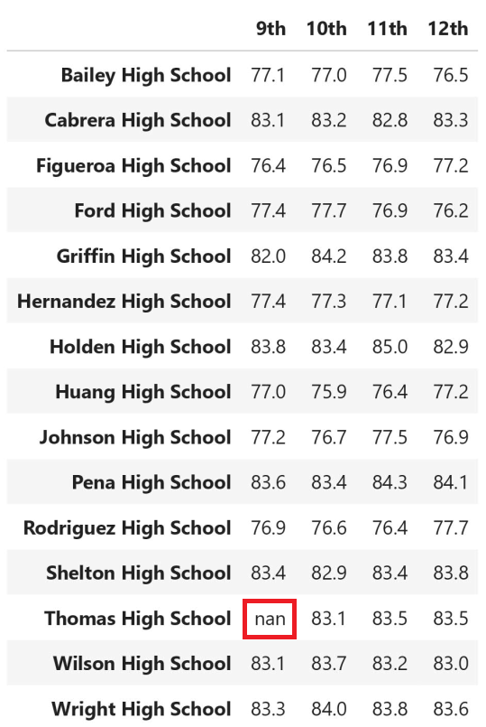

# School District Analysis 

## Purpose
A school board has requested an analysis of the schools within the district.  This will provide the detailed information that will inform their decisions around school funding, based on student performance.

## Overview
The analysis consists of two CSV data files.  

The ```schools_complete.csv``` file identifies each school within the district, and provides information about the type of school, the number of students, and the school budget.

The ```students_complete.csv``` file lists all of the students within the school district, and identifies their school, gender, grade, and reading and math scores.

The student names were reviewed and cleaned to ensure they aligned with the school records, by removing formal identifier and professional titles that appeared within the file data.

Since the completion of tha analysis, the school board has discovered evidence of academic dishonesty within the math and reading scores for the 9th grade students of Thomas High School. The extent of the dishonesty is unknown so portions of the school district analysis have been revised to eliminate the suspect influence on the report. 

In this case, the math and reading scores for these students were removed and replaced with NaNs, so they would not be considered during the analysis.

The results below will describe the effects of the data replacement throughout the analysis, focusing on how the standing of the Thomas High School is impacted by this action.

# Results

## Effects on District Summary

There were no substantial effects on the district summary analysis results. When comparing the original analysis against the revised analysis results, the only visible difference is in the data formatting which had originally presented whole percentages with percent signs.

* Original District Summary results:


* Revised District Summary results:


This result is vital for allowing the school board to determine the overall performance of the district.  The removal of the suspect data shows that the overall district performance is still aligned with the results from the initial (original) analysis.

## Effects on School Summary

As expected, the school summary results were directly affected, with the impact confined to the Thomas High School performance figures.

* Original School Summary Results:


* Revised School Summary Results:


The score and percentages were negatively affected.

## Effects on Thomas High School's Relative Performance

* General Performance
	* Thomas High School is one of the top performing schools in this school district.  The decision to remove the entire 9th grade math and reading scores did cause a decline in the values for average math and average reading scores, as well as for the performance percentages. However, because of the high performance of the school, this action appeared to have minimal impact on the individual metrics, and did not change the school's ranking within the Top-5 schools.

* Math and Reading Scores by Grade
	* The only difference in the reported scores is the removal of the 9th grade math and reading scores from the report for Thomas High School.
	
	* Revised Math Scores by Grade
	


	* Revised Reading Scores by Grade
	


* Scores by School Spending
	* The Thomas High School math, reading, and percentages scores, all suffered a slight negative impact.


* Scores by School Size
	* The scores in this portion of the revised analysis were unaffected by the revision of the Thomas High School 9th grade student data.


* Scores by School Type
	* The scores in this portion of the revised analysis were unaffected by the revision of the Thomas High School 9th grade student data.

# Summary & Conclusions
Summary: The school district analysis was re-executed after the reading and math scores for the ninth grade at Thomas High School were replaced with NaNs.  This lead to the following changes within the analysis report:
* The school summary data for Thomas High School was negatively impacted.
* The "math scores by grade" did not contain a value for the Thomas High School 9th grade.
* The "reading scores by grade" did not contain a value for the Thomas High School 9th grade.
* The Thomas High School entries within the "Scores by School Spending" were negatively impacted.

## Conclusion

The decision to eliminate the suspect data with the Thomas High School 9th grade math and reading scores, was a good choice.  It reduces risks associated with the validity of the analysis and still allowed the school ranking and district performance measurement to proceed with minimal impact.  As reported through this analysis, the data impact was confined to the direct measures associated with the Thomas High School.